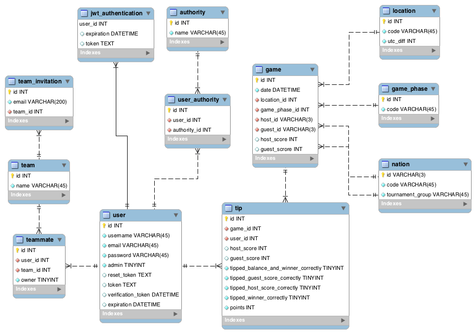

# WODSS Tippspiel

**Workshop project of David Heimgartner, Gerhard Hirschfeld &amp; Ken Iseli**

---

## Table of Content

- [Contributors](#-contributors)
- [Project Structure](#-project-structure)
- [Database schema](#-database-schema)
- [API](#-api-documentation)
- [UI Wireframes](#-ui-wireframes)

---

## Contributors

In this section are the contributors listed with their developed components.

| Contributor        | Frontend | Backend |
| ------------------ | -------- | ------- |
| [Ken Iseli](https://github.com/orgs/fhnw-students/people/keniseli)          | Rankings | Authentication, Ranking, Translations, Setup |
| [David Heimgartner](https://github.com/orgs/fhnw-students/people/davidheimgartner) | Password-Reset, Profile, Teams | Teams |
| [Gerhard Hirschfeld](https://github.com/orgs/fhnw-students/people/hirsch88) | Login, Registration, Admin, Games, Setup | Admin, Games, Setup |

---

## Project Structure

To manage our project we create a project on GitHub.

[Go to the project board](https://github.com/orgs/fhnw-students/projects/1)

We divided our project into 3 repositories:

- [Documentation](https://github.com/fhnw-students/wodss-tippspiel-doc)
- [Java Spring / REST API](https://github.com/fhnw-students/wodss-tippspiel-api)
- [Vue.JS Frontend Application](https://github.com/fhnw-students/wodss-tippspiel-web)

Every repository is setup with a `README.md` file which explains how to setup and run the application. Moreover, we used `Travis` as CI for our frontend and backend project to build and test it. After `Travis` builded the application successfully `heroku` deploys the application in the cloud. To access the application could take a while, due to the free solution (if the apps are unused they go in sleep mode) of `heroku`.

- [Deployed frontend application](https://wodss-tippspiel-web.herokuapp.com/)
- [Deployed backend application](https://wodss-tippspiel-api.herokuapp.com/)

The slides of the final presentation can be found here: 

- [Final presentation](https://fhnw-students.github.io/wodss-tippspiel-presentation/)

---

## Database schema



### Static data

Static data are the `location`, `nation` and the `game_phase` table. These tables will not be changed by the application.

### User

TODO

### Team

A `user` can create a `team` and invite other users to this `team` by e-mail. Therefore, a `team` consists of several selected users. A `team` has an owner. The creator of the `team` acts as owner. If the owner leaves the group, the new owner will be next user.
Invitations have to be made by e-mail address. The invited person gets an e-mail, logs in and can accept or deny the invitation. 
A user can be member of maximum five teams. If he wants to accept the invitation of a new `team`, he has to leave another `team` firstly.

A `team` can not be deleted by an `user` or owner. It will be deleted self-acting when the last user leaves the `team`.

### Games & Tips

The `game` table represents a soccer game like Spain vs Peru. Only an administrator is able to create, update and delete games.

A user can bet a game and this will be stored in the `tip` table. However, he can only alter the score fields and before the game has started. After the admin has enter the score of a game all tips will receive their points.

### Profile
At the beginning, a profile page was implemented. However, it was only possible to change the own password and the avatar. After we discovered Gravatar as avatar service there was only the possibility to change the password. The avatar can be changed by change it at the Gravatar website.
Because of the duration of the world cup tournament the probability that a user wants to change his password is quite small. In addition, the password can be reset if a user has forgotten it. Therefore, we decided to delete the profile page.

---

## API documentation

We defined our API with the help of an awesome tool called Swagger. Moreover,  we deployed it on `heroku` to have a live API documentation of our project.

[Go to the Swagger Documentation](https://wodss-tippspiel-swagger.herokuapp.com/)

### How to alter the API documentation

1. Open the [Swagger Editor](https://editor.swagger.io).
2. Copy the [Swagger File](https://raw.githubusercontent.com/fhnw-students/wodss-tippspiel-doc/master/swagger.yml) into the Swagger Editor.
3. Change it
4. Copy the new documentation back into repository
5. Commit your changes.

---

## UI Wireframes

We put the wireframes into a separate document.

[Go to the UI Wireframs](./UI_WIREFRAMES.md).

## Frontend

### Application Structure

The chosen JS-framework Vue.js does not force a specific structure. However, the ecosystem provides some useful tools and libraries to build large scale application.

```
├── public  # static files like index.html & favicon
├── src
│   ├── assets               # Fonts and images
│   ├── components
│   │   ├── Hello.vue        # Vue.JS components
│   │   └── ...
│   ├── config
│   │   └── app.config.ts    # configuration from the .env* files
│   ├── locals
│   │   ├── de.ts            # Translation files
│   │   └── ...
│   ├── models
│   ├── pages                # Page components
│   ├── plugins
│   │   └── **/*.plugin.ts   # Vue.JS plugins
│   ├── routes               # All defined application routes are here
│   ├── services
│   │   ├── api              # All service for making api requests
│   │   └── **/*.service.ts
│   ├── store                # Vuex store
│   │   ├── modules
│   │   └── index.ts
│   ├── styles               # Global styles written in SASS
│   ├── types                # Custom type definitions
│   ├── App.vue              # Main component
│   └── main.ts              # Bootstraps the app
├── .env.development         # App configuration for the development environment
├── .env.production
├── .travis.yml              # CI configuration
├── package.json
├── Procfile                 # Defines the run command for heroku
├── README.md                # Documentation
├── server.js                # Small web-server for deploying on heroku
├── static.json              # Defines the root path for heroku
├── tsconfig.json            # TypeScript configuration
├── tslint.json              # TypeScript lint configuration
└── vue.config.js            # Extends the webpack config
```

### Libraries

For the most libraries plugins are defined to serve the library through the Vue instance.

#### Axios

`Axios` is a promised based HTTP client for the browser. In this project it used for all the AJAX-request.

[Go to axios](https://github.com/mzabriskie/axios)

We used a response interceptor to catch the 401 responses to redirect the user to the login page. Moreover, there is a request interceptor to set the used language.

All the `./src/services/api/*.api.ts` use this library.

#### Internationalization

To serve various languages we used the `vue-i18n` plugin. The translations are located in `./src/locals/<lang_key>.ts`.

[Go to the vue-i18n](https://kazupon.github.io/vue-i18n/)

#### Routing

Routing is done by the plugin `vue-router`. All the routes are configured in `./src/routes/index.ts`. We defined to route the following properties:

- **auth** These routes must have a valid authentication.
- **guest** These routes are only accessible when nobody is authenticated.

In the router plugin file `./src/plugins/vue-router.plugin.ts` we defined a middleware which listens to those properties and redirects if necessary.

[Go to the vue-router](http://router.vuejs.org/en/index.html)

#### Styling

For the main styles we used `bootstrap version 4`. This is written in Sass and makes in easy to customize thanks to all the defined variables. Moreover, it has a flexible grid solution to handle responsive issues.

Icons are used from the library `font-awesome` and all the nation flags are from the `flag-icon-css` library.

[Go to bootstrap](https://getbootstrap.com/)

[Go to font-awesome](https://fontawesome.com/)

[Go to flag-icon-css](http://flag-icon-css.lip.is)

#### Store Management

To serve a global store over all the components we used vuex. Vuex is not just a libary it is a `state management pattern` as well. It is heavily inspired by the flux and redux pattern.


| Source from [vuex](https://vuex.vuejs.org/en/intro.html)

[Go to vuex](http://vuex.vuejs.org/en/index.html)

The image above shows the flow of the `state management pattern`. As example, the use-case of the login process is mapped.

Firstly, the user fills out correctly the login form and submits the action `signInUser(...)`. The actions are bound with the annotation `@Action(AuthActions.SignInUser)`.

```
@Component({
  components: {
    SpinnerButton,
  },
})
export default class Login extends Vue {
  public username = '';
  public password = '';
  public isSpinning = true;

  @Getter(AuthGetters.IsAuthenticated)
  public isAuthenticated: boolean;

  @Getter(AuthGetters.IsFetching)
  public isFetching: boolean;

  @Getter(AuthGetters.LoginHasFailed)
  public hasFailed: boolean;

  @Action(AuthActions.SignInUser)
  public signInUser: (cred: Credentials) => void;

  private log = this.$createLogger('Login');

  public async signIn(): Promise<void> {
    const isValid = await this.$validator.validateAll();
    if (isValid) {
      this.log.info('Try to sign in the user.');
      this.signInUser({
        username: this.username,
        password: this.password,
      });
    } else {
      this.$noty.warning('message.login_incomplete');
    }
  }
	...
```

The action `actionTypes.SIGN_IN_USER` firstly mutates the auth state, so that the user sees a spinner. Afterwards, the api call for the login is requested. When the request-promise resolves, the given token will be committed to the `mutationTypes.SIGN_IN_USER_SUCCESS` mutation,
otherwise the `mutationTypes.SIGN_IN_USER_FAILED` mutation will be called.

```
export const actions: ActionTree<AuthState, AuthState> = {
  [actionTypes.SIGN_IN_USER]({ commit, state }: ActionContext<AuthState, AuthState>, credentials: Credentials): void {
    commit(mutationTypes.SIGN_IN_USER_REQUESTED);
    authApi.signIn(credentials.username, credentials.password)
      .then((token: string) => commit(mutationTypes.SIGN_IN_USER_SUCCESS, token))
      .catch((err: any) => commit(mutationTypes.SIGN_IN_USER_FAILED, err));
  },
	...
```

Here the mutation of the login process are shown. Like mentioned above, the `SIGN_IN_USER_REQUESTED` mutation only sets the `isFetching` to true,so a spinner is shown to the user.
The `SIGN_IN_USER_SUCCESS` mutation is called when the login request was successful and a token is sent by the backend. This will set the token as a common authorization header for all further api requests. Moreover, it stores the token in the local-storage and mutates the state.

```
export const mutations: MutationTree<AuthState> = {
  [mutationTypes.SIGN_IN_USER_REQUESTED](state: AuthState): void {
    state.isFetching = true;
    state.isAuthenticated = false;
    state.loginHasFailed = false;
  },

  [mutationTypes.SIGN_IN_USER_SUCCESS](state: AuthState, token: string): void {
    tokenService.setToken(token);
    Vue.$http.defaults.headers.common.Authorization = `Bearer ${token}`;

    state.isFetching = false;
    state.isAuthenticated = true;
    state.loginHasFailed = false;
  },

  [mutationTypes.SIGN_IN_USER_FAILED](state: AuthState, error: any): void {
    state.isFetching = false;
    state.isAuthenticated = false;
    state.loginHasFailed = true;
  },
	...
```

After the states are mutated, the components receive the new data and re-render their view.

## Backend

TOOD
