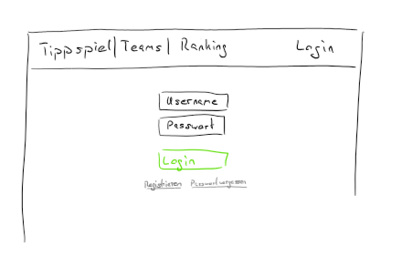
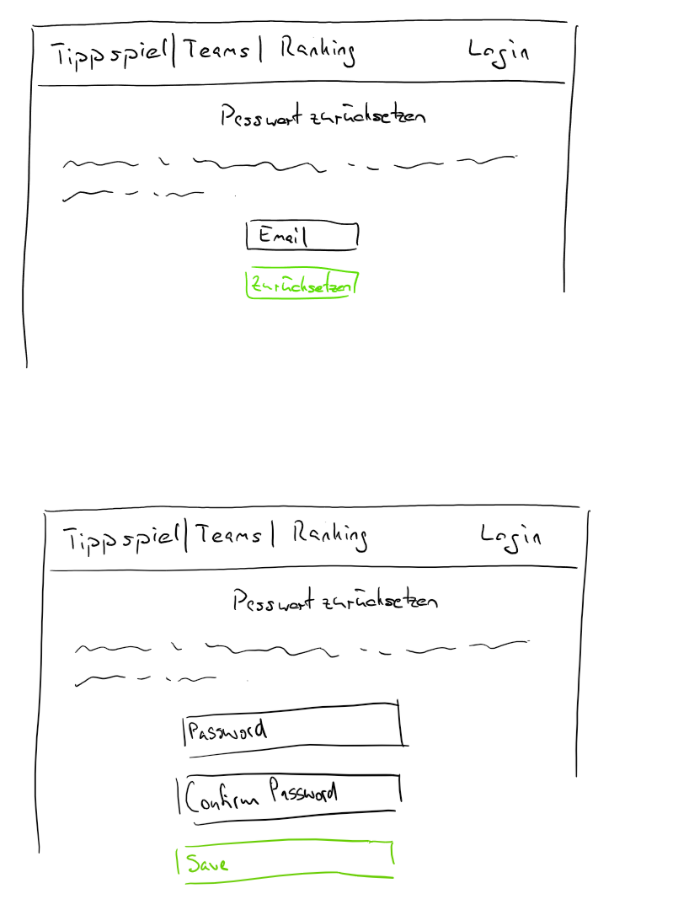
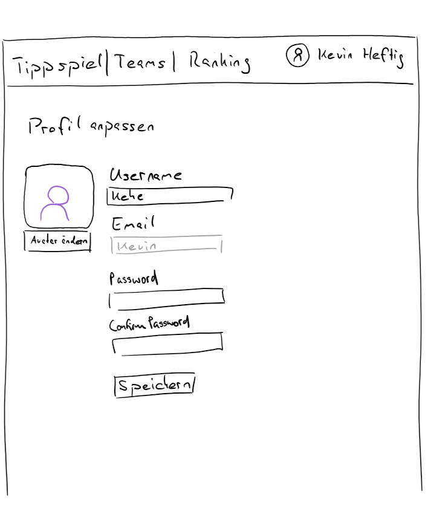
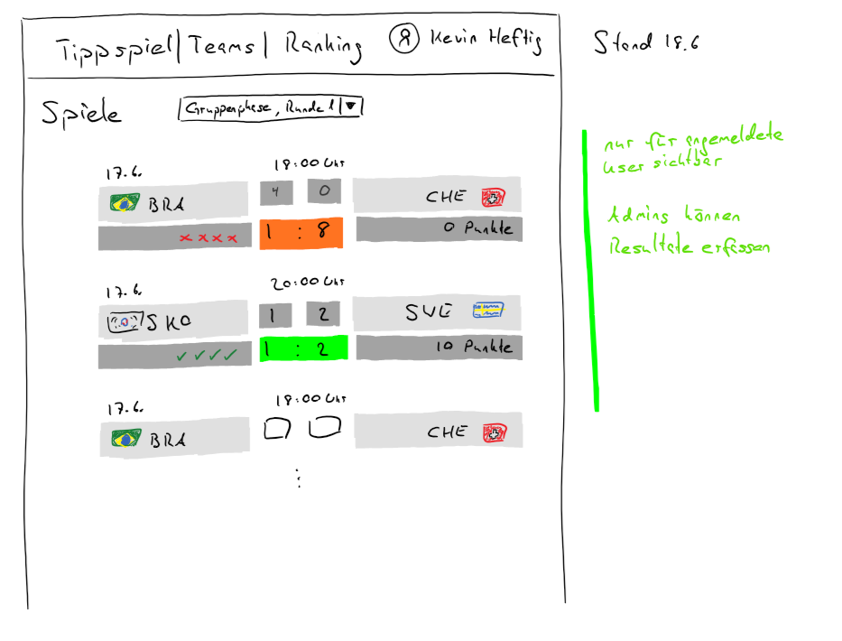
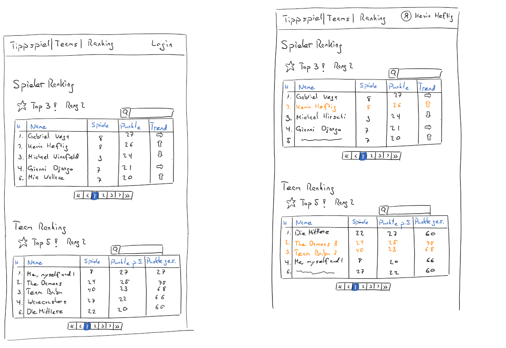

# WODSS Tippspiel

**Workshop project of David Heimgarnter, Gerhard Hirschfeld &amp; Ken Iseli**

---

## Database schema

---

## API documentation

To create the API documentation we used swagger.

1. Open the [Swagger Editor](https://editor.swagger.io).
2. Copy the [Swagger File](https://raw.githubusercontent.com/fhnw-students/wodss-tippspiel-doc/master/swagger.yml) into the Swagger Editor.

---

## UI Wireframes

### User Registration

### User Login

### Forgot Password

### Profile

### Games

### Teams

### Ranking

